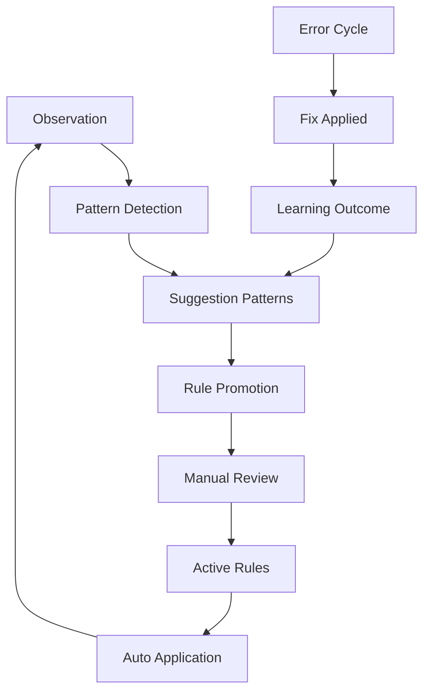

# KnowCore Architecture Specification v1.0

## 📋 Общие сведения

**Версия:** 1.0  
**Дата:** 2025-06-30  
**Статус:** Active  
**Область применения:** Архитектурный стандарт для семейства совместимых ИИ-систем

## 🎯 Назначение спецификации

Данная спецификация определяет **единые архитектурные принципы, паттерны и стандарты** для разработки модульных ИИ-систем, совместимых с экосистемой KnowCore.

### Цели стандартизации

- **Модульная совместимость** - компоненты разных систем взаимозаменяемы
- **Архитектурное единообразие** - единые принципы проектирования
- **Композиция систем** - возможность объединения в сложные решения
- **Переиспользование кода** - модули работают в разных контекстах

---

## 🏗️ Фундаментальные принципы

### 1. **Принцип модульности (Module Isolation)**

```yaml
Определение: Каждый модуль имеет четкие границы и публичный интерфейс
Требования:
  - Модуль не изменяет логику других модулей
  - Взаимодействие только через определенные интерфейсы
  - Возможность замены модуля без изменения системы
  - Независимое тестирование и разработка
```

### 2. **Принцип Description = Implementation**

```yaml
Определение: Логика дублируется в текстовом описании и исполняемом коде
Требования:
  - Каждый метод имеет текстовое описание алгоритма
  - Описание позволяет воспроизвести логику без кода
  - LLM может исполнить алгоритм по description
  - Синхронизация описания и реализации
```

### 3. **Принцип конфигурируемости (Configuration-Driven)**

```yaml
Определение: Поведение системы управляется централизованной конфигурацией
Требования:
  - Единый источник параметров (Module::Config)
  - Запрет "жестко прошитых" констант
  - Возможность изменения поведения без кода
  - Наследование настроек между модулями
```

### 4. **Принцип самообучения (Self-Learning)**

```yaml
Определение: Система формирует правила на основе наблюдений
Требования:
  - Двухконтурная система: patterns → rules → application
  - Логирование всех решений и изменений
  - Автоматическое формирование обучающих паттернов
  - Ручное подтверждение критических правил
```

### 6. **Принцип нормализации данных (Data Normalization)**

```yaml
Определение: Все входящие данные проходят классификацию и нормализацию
Требования:
  - Централизованные справочники терминов (ValueLists)
  - Интеллектуальное сопоставление (точное, fuzzy, семантическое)
  - Классификация источника данных (standard/user/system)
  - Конфигурируемые пороги точности поиска
  - Автоматическое пополнение справочников
```

### 7. **Принцип контейнеризации данных (Data Containerization)**

```yaml
Определение: Справочные данные хранятся в специализированных контейнерах
Требования:
  - Отделение данных от логики через YAML-блоки между маркерами
  - Обновление данных без изменения кода модуля
  - Единый интерфейс доступа к данным любого типа
  - Версионирование и валидация данных
  - Атомарные обновления и возможность отката
```

### 8. **Принцип расширенного аудита (Comprehensive Logging)**

```yaml
Определение: Все действия и решения системы протоколируются
Требования:
  - Логирование решений по полям
  - Фиксация циклов исправлений
  - Трекинг применения правил
  - Метрики качества и производительности
```

---

## 🏛️ Архитектурные компоненты

### 1. **Config Module (Конфигурационный центр)**

#### Назначение

Единственный источник параметров, управляющих поведением всей системы.

#### Структура

```yaml
Module::Config:
  description: "Центральный источник параметров системы"
  
  # Основные секции
  sections:
    field_matching:     # Параметры сопоставления значений
      global: {}        # Глобальные настройки
      overrides: {}     # Индивидуальные настройки полей
      scale_mapping: {} # Формулы пересчета порогов
      
    prompts:           # Настройки генерации контента
      default_style: "markdown"
      summary: {}      # Конфигурация блока summary
      description: {}  # Конфигурация подробного описания
      
    validation: {}     # Параметры валидации
    learning_log: {}   # Настройки логирования  
    endsession_output: {} # Состав финального вывода
```

#### Принципы использования

- **Приоритет Config**: Любое отклонение от значений Config = ошибка
- **Наследование**: Модули читают Config первыми
- **Расширяемость**: Новые секции добавляются без изменения существующих
- **Валидация**: Config проверяется при инициализации системы

### 2. **Module System (Модульная система)**

#### Стандартная структура модуля

```yaml
Module::<Name>:
  description: "Подробное описание назначения и роли"
  
  # Внутреннее состояние (опционально)
  _state: {}
  _cache: {}
  
  # Публичный интерфейс
  methods:
    - method_name(params) → return_type
      guard: {}        # Условия безопасности
      description: >   # Текстовый алгоритм
        Пошаговое описание логики...
      implementation: | # Исполняемый код
        # PSEUDOCODE
        pass
        
  # Интеграция с другими модулями  
  integration:
    used_by: []       # Кто использует модуль
    depends_on: []    # От каких модулей зависит
    reads_from: []    # Откуда читает данные
    writes_to: []     # Куда записывает данные
    
  status: active|deprecated|testing
```

#### Типы модулей

1. **Core Modules** - базовая функциональность (Config, LearningLog)
2. **Data Container Modules** - хранение справочных данных (ValueLists, PromptTemplates, BusinessRules, SystemConstants)
3. **Domain Modules** - предметная логика (Validation, BasePrompt, Lists, TrainingManager)
4. **Integration Modules** - внешние интерфейсы (API, Storage, WebHooks)
5. **Extension Modules** - дополнительная функциональность (Analytics, Reporting)

#### Характеристики типов модулей

##### **Core Modules**

```yaml
Назначение: Фундаментальная инфраструктура системы
Особенности:
  - Обязательны для работы любой системы
  - Не зависят от предметной области
  - Управляют состоянием и конфигурацией
  - Обеспечивают логирование и аудит
Примеры: Config, LearningLog, Session
```

##### **Data Container Modules**

```yaml
Назначение: Хранение и управление справочными данными
Особенности:
  - Отделяют данные от логики
  - Обновляются без изменения кода
  - Реализуют единый DataContainer интерфейс
  - Поддерживают версионирование данных
  - Обеспечивают валидацию целостности
Примеры: ValueLists, PromptTemplates, BusinessRules, SystemConstants
```

##### **Domain Modules**

```yaml
Назначение: Реализация бизнес-логики и предметных алгоритмов
Особенности:
  - Содержат основную функциональность системы
  - Зависят от Core и Data Container модулей
  - Реализуют Description = Implementation принцип
  - Используют Guard-паттерны для безопасности
Примеры: Validation, BasePrompt, Lists, TrainingManager
```

##### **Integration Modules**

```yaml
Назначение: Взаимодействие с внешними системами
Особенности:
  - Адаптеры для внешних API и сервисов
  - Изолируют систему от внешних зависимостей
  - Обеспечивают стандартизированные интерфейсы
  - Содержат логику ретраев и обработки ошибок
Примеры: APIClient, FileStorage, WebHooks, DatabaseAdapter
```

##### **Extension Modules**

```yaml
Назначение: Дополнительная функциональность и расширения
Особенности:
  - Опциональные для базовой работы системы
  - Расширяют возможности без изменения ядра
  - Могут быть domain-specific
  - Легко добавляются и удаляются
Примеры: Analytics, Reporting, Metrics, Notifications
```

### 3. **Command System (Командная система)**

#### Стандартная структура команды

```yaml
Command::<Name>:
  group: "Группа команд"
  syntax: "Синтаксис вызова"
  modes: [Operator, Silent]  # В каких режимах доступна
  auto: false               # Автоматический вызов
  
  description: >
    Подробное описание назначения команды
    
  guard:                    # Условия безопасности
    if: "условие"
    then: "действие"
    
  logic: >                  # Пошаговый алгоритм
    Шаг 1. Действие...
    Шаг 2. Действие...
    
  methods:                  # Исполняемые методы
    - execute(params) → result
      
  output:                   # Формат вывода
    format: "yaml|markdown|json"
    method: "chat|api|file"
    
  interaction:              # Взаимодействие
    used_for: []           # Цели использования
    triggers: []           # Что запускает
    calls: []              # Какие методы вызывает
    
  status: active
```

#### Группы команд

- **session_management** - управление сессией
- **validation** - валидация данных
- **value_lists** - работа со списками
- **card_operations** - операции с карточками

### 4. **Data Container System (Система контейнеров данных)**

#### Архитектурный принцип

**Универсальный паттерн для хранения любых справочных данных** — от списков значений до конфигурационных констант, шаблонов, правил и классификаторов.

#### Паттерн Data Container

```yaml
Data_Container_Pattern:
  principle: "Отделение данных от логики через контейнеры"
  
  core_concept:
    - Данные хранятся в специальных YAML-блоках между маркерами
    - Код модуля работает с данными через единый интерфейс
    - Обновление данных не требует изменения кода
    - Версионирование и миграции данных независимы
    
  universal_structure:
    Module::<n>_Data:
      description: "Контейнер данных для конкретной задачи"
      
      state:
        data: {}          # Загружается при init()
        
      data_markers:       # Блок между маркерами в коде
        "<<< <NAME>_DATA START"
        DATA_BLOCK:       # YAML-структура данных
          category1: {}
          category2: {}
        "<<< <NAME>_DATA END"
        
      interface:
        - init() → None                    # Загрузка данных
        - get(key: str) → any             # Получение значения
        - has(key: str) → bool            # Проверка существования
        - keys() → list                   # Список ключей
        - validate() → bool               # Валидация целостности
        
      update_safety:
        external_script: "Изменяет только DATA_BLOCK"
        code_isolation: "Логика модуля неизменна"
        atomic_updates: "Обновление целого блока"
        rollback_support: "Возврат к предыдущей версии"
```

#### Типы контейнеров данных

##### **1. ValueLists Container (Справочники терминов)**

```yaml
Module::ValueLists:
  container_type: "Terminology Repository"
  data_structure:
    VALUE_LISTS_DATA:
      function: [обучение, аналитика, ...]
      tags: [AI, образование, ...]
      products: [GPT-4, Claude 3, ...]
      entities: [OpenAI, Google, ...]
      paths: ["#AI#Навыки#Письмо", ...]
      
  use_cases:
    - Нормализация пользовательского ввода
    - Валидация соответствия справочникам
    - Автозаполнение и подсказки
    - Аналитика покрытия терминологии
```

##### **2. Templates Container (Шаблоны и промпты)**

```yaml
Module::PromptTemplates:
  container_type: "Template Repository" 
  data_structure:
    PROMPT_TEMPLATES_DATA:
      system_prompts:
        card_generation: "Создай карточку знаний..."
        validation: "Проверь структуру..."
      user_templates:
        summary: "Кратко опиши в 3-5 предложений..."
        description: "Дай развернутое описание..."
      response_formats:
        yaml_card: "---\nid: ...\n---"
        json_result: '{"status": "...", "data": {}}'
        
  use_cases:
    - Динамическая генерация промптов
    - A/B тестирование формулировок
    - Локализация текстов
    - Версионирование промптов
```

##### **3. Rules Container (Правила и политики)**

```yaml
Module::BusinessRules:
  container_type: "Rules Repository"
  data_structure:
    BUSINESS_RULES_DATA:
      validation_rules:
        required_fields: [title, type, function]
        field_constraints: {...}
      processing_rules:
        auto_corrections: {...}
        classification_logic: {...}
      policy_rules:
        data_retention: "30 days"
        access_control: {...}
        
  use_cases:
    - Бизнес-логика без хардкода
    - Политики безопасности
    - Правила обработки данных
    - Конфигурируемые ограничения
```

##### **4. Constants Container (Константы и настройки)**

```yaml
Module::SystemConstants:
  container_type: "Constants Repository"
  data_structure:
    SYSTEM_CONSTANTS_DATA:
      limits:
        max_tokens: 4000
        max_fields: 50
        timeout_seconds: 300
      formats:
        date_format: "YYYY-MM-DD"
        id_pattern: "card-{timestamp}{random}"
      endpoints:
        api_base: "https://api.example.com"
        webhook_url: "https://hooks.example.com"
        
  use_cases:
    - Системные ограничения
    - Форматы данных
    - Внешние URL и эндпоинты
    - Технические константы
```

#### Архитектурная ценность паттерна

```yaml
Separation_of_Concerns:
  - Данные отделены от логики
  - Изменение данных не влияет на код
  - Независимое версионирование компонентов
  
Maintainability:
  - Обновление справочников без релиза
  - Горячее обновление конфигураций
  - Простое добавление новых категорий данных
  
Scalability:
  - Любые типы справочных данных
  - Множественные контейнеры в системе
  - Распределенное управление данными
  
Testability:
  - Мокирование данных для тестов
  - Валидация целостности данных
  - Изолированное тестирование логики
  
Governance:
  - Контроль качества данных
  - Аудит изменений данных
  - Права доступа к обновлениям
```

##### **Lists Module (Классификатор значений)**

```yaml
Module::Lists:
  description: "Интеллектуальная классификация и нормализация значений"
  
  core_algorithm:
    classification_levels:
      1. exact_match      # Точное совпадение с эталоном
      2. fuzzy_match      # Совпадение с учетом опечаток
      3. semantic_match   # Семантическая близость через эмбеддинги
      4. source_detection # Определение источника (user/system)
      
    return_statuses:
      - standard_list     # Найден в эталонных списках
      - user_input       # Введен пользователем вручную
      - system_generated # Сгенерирован системой
      
  advanced_features:
    multivalue_support: "Обработка строк вида 'обучение, аналитика'"
    embedding_cache: "Кэширование эмбеддингов стандартных значений"
    configurable_thresholds: "Пороги через Module::Config"
    deduplication: "Автоматическая дедупликация тегов"
    
  integration_points:
    used_by: [Validation, /ShowCardValues, /ListsCard]
    feeds_into: [LearningLog.new_values, TrainingManager]
    reads_from: [ValueLists, Config.field_matching]
```

#### Конфигурируемость через Config

```yaml
Config.field_matching:
  # Глобальные пороги
  global:
    fuzzy_scale: 0.20        # 0=строго, 1=мягко
    semantic_scale: 0.10     # порог семантической близости
    list_suggestions_max: 5  # количество предложений
    single_value_mode: strict # strict/loose для списков
    
  # Формулы пересчета
  scale_mapping:
    fuzzy_max_dist_max: 4    # максимум символов Левенштейна
    semantic_threshold_lo: 0.65 # минимум cosine similarity
    
  # Индивидуальные настройки полей
  overrides:
    tags:
      fuzzy_scale: 0.40      # более мягкий поиск для тегов
      semantic_scale: 0.20
```

#### Архитектурная ценность

```yaml
Data_Quality_Control:
  - Автоматическая нормализация терминологии
  - Предотвращение дубликатов и вариантов написания
  - Контролируемое расширение словарей
  
Intelligent_Matching:
  - Обработка опечаток через fuzzy matching
  - Семантический поиск через эмбеддинги
  - Адаптивные пороги по типам полей
  
Learning_Integration:
  - Фиксация новых терминов в LearningLog
  - Формирование suggestion_patterns
  - Автоматическое обогащение справочников
  
Scalability:
  - Независимое обновление справочников
  - Кэширование для производительности
  - Конфигурируемое поведение без кода
```

### 5. **Rules System (Система правил)**

#### Структура правила

```yaml
Rule:
  rule_id: "pat-XXX"           # Уникальный идентификатор
  applies_to:
    field: "field_name"        # К какому полю применяется
  instruction: "действие"      # Что делать
  pattern_identified: "паттерн" # Обнаруженный паттерн
  generalization: "условие"    # Обобщенное условие
  type: "training|strict"      # Тип правила
  status: "active|proposed|deprecated"
  priority: 1-10              # Приоритет применения
  confidence: 0.0-1.0         # Уверенность в правиле
  created_by: "источник"      # Кто создал
  date_added: "YYYY-MM-DD"    # Дата добавления
```

#### Жизненный цикл правил

1. **Observation** - система наблюдает паттерны
2. **Pattern Formation** - формируются suggestion_patterns
3. **Rule Promotion** - patterns становятся proposed rules
4. **Validation** - ручная проверка и подтверждение
5. **Activation** - правило становится active
6. **Application** - автоматическое применение
7. **Monitoring** - отслеживание эффективности

### 5. **Learning System (Система обучения)**

#### Двухконтурное обучение



#### Компоненты обучения

- **LearningLog** - журналирование решений и действий
- **TrainingManager** - управление правилами и их применением
- **Validation** - контроль качества обучения
- **Rules** - хранилище обучающих правил

---

## 🔄 Режимы работы

### 1. **Operator Mode (Интерактивный)**

```yaml
Характеристики:
  - Пошаговое выполнение с подтверждениями
  - Coach Logic - навигационные подсказки
  - Циклы "ОШИБКА → ИСПРАВЛЕНО"
  - Ручное управление и правки
  
Применение:
  - Обучение системы
  - Работа с новыми типами данных
  - Отладка и тестирование
  - Качественная обработка важных материалов
```

### 2. **Silent Mode (Автоматический)**

```yaml
Характеристики:
  - Полностью автоматическое выполнение
  - Один входной запрос → один результат
  - Применение всех active правил
  - API-совместимость
  
Применение:
  - Массовая обработка данных
  - API-интеграции
  - Автоматизированные пайплайны
  - Продакшн-обработка
```

---

## 🔧 Паттерны взаимодействия

### 1. **Guard Pattern (Паттерн защиты)**

```yaml
Применение: Перед выполнением критических операций
Структура:
  guard:
    if: "условие проверки"
    then: "действие при нарушении"
    
Примеры:
  - Проверка незавершенных циклов ошибок
  - Валидация состояния системы
  - Контроль доступа к ресурсам
```

### 2. **Error-Fix-Learn Pattern**

```yaml
Цель: Превращение ошибок в обучающие паттерны
Этапы:
  1. ОШИБКА - фиксация проблемы
  2. Анализ - определение причины
  3. ИСПРАВЛЕНО - применение решения
  4. Обучение - создание правила
  5. Применение - автоматическое исправление в будущем
```

### 3. **Classification Pattern**

```yaml
Применение: Определение статуса и обработка значений
Категории:
  - standard_list - найдено в справочниках
  - system_generated - создано системой
  - user_input - введено вручную
  
Использование:
  - Валидация данных
  - Формирование новых списков
  - Аналитика источников данных
```

### 5. **Data Classification Pattern (Паттерн классификации данных)**

```yaml
Принцип: Каждое значение проходит многоуровневую классификацию
Цель: Обеспечение качества и единообразия терминологии

Алгоритм классификации:
  1. normalize(value) - приведение к стандартному виду
  2. exact_match - поиск точного совпадения в ValueLists
  3. fuzzy_match - поиск с учетом опечаток (Levenshtein)
  4. semantic_match - поиск по семантической близости
  5. source_detection - определение источника значения
  
Результат:
  status: standard_list|user_input|system_generated
  resolved_value: нормализованное значение или исходное

Применение:
  - Валидация всех полей карточки
  - Формирование новых справочников
  - Аналитика источников данных
  - Обучение системы на терминологии
```

### 6. **Multi-Level Validation Pattern**

```yaml
Уровни валидации:
  1. Structure - проверка обязательных полей
  2. Relations - связность между полями  
  3. Lists - соответствие справочникам
  4. Rules - соблюдение strict-правил
  5. Quality - RAG-метрики и пригодность
```

---

## 🔌 Интеграционные интерфейсы

### 1. **Module Interface**

```typescript
interface ModuleInterface {
  // Основные методы
  init(): void;
  execute(params: any): any;
  validate(data: any): boolean;
  
  // Метаинформация
  getStatus(): ModuleStatus;
  getDependencies(): string[];
  getIntegrations(): IntegrationMap;
}
```

### 2. **Command Interface**

```typescript
interface CommandInterface {
  // Выполнение команды
  execute(context: Context): Result;
  
  // Проверки
  canExecute(context: Context): boolean;
  validate(params: any): ValidationResult;
  
  // Метаданные
  getSyntax(): string;
  getDescription(): string;
  getModes(): ExecutionMode[];
}
```

### 4. **ValueLists Interface**

```typescript
interface ValueListsInterface {
  // Инициализация данных
  init(): void;
  
  // Получение справочников
  get(field: string): string[];
  getAll(): Record<string, string[]>;
  
  // Метаинформация
  getFields(): string[];
  getSize(field: string): number;
  
  // Валидация
  hasField(field: string): boolean;
  contains(field: string, value: string): boolean;
}
```

### 5. **Classification Interface**

```typescript
interface ClassificationInterface {
  // Основная классификация
  classify(field: string, value: string|string[]): ClassificationResult;
  
  // Вспомогательные методы
  normalize(value: string): string|string[];
  fuzzyMatch(value: string, candidates: string[]): MatchResult;
  semanticMatch(value: string, candidates: string[]): MatchResult;
  
  // Конфигурация
  getFieldOptions(field: string): FieldOptions;
  
  // Результаты
  interface ClassificationResult {
    status: 'standard_list' | 'user_input' | 'system_generated';
    resolved_value: string;
    confidence?: number;
    alternatives?: string[];
  }
}
```

### 6. **Config Interface**

```typescript
interface ConfigInterface {
  // Получение конфигурации
  get(path: string): any;
  getSection(section: string): object;
  
  // Валидация
  validate(): boolean;
  validateSection(section: string): boolean;
  
  // Обновление (если поддерживается)
  update(path: string, value: any): void;
}
```

---

## 📏 Стандарты разработки

### 1. **Naming Conventions**

```yaml
Modules: "Module::<Name>"
Commands: "Command::<Name>" или "/<Name>"
Rules: "pat-XXX" (pattern-based)
Config Sections: "snake_case"
Methods: "snake_case"
Fields: "snake_case"
Constants: "UPPER_CASE"
```

### 2. **Documentation Standards**

```yaml
Каждый компонент должен содержать:
  - description: подробное описание назначения
  - methods: список всех методов с описанием
  - integration: связи с другими модулями
  - status: текущий статус компонента
  - examples: примеры использования (где применимо)
```

### 3. **Error Handling**

```yaml
Принципы:
  - Graceful degradation - система продолжает работу
  - Информативные сообщения об ошибках
  - Логирование всех исключений
  - Возможность восстановления состояния
```

### 5. **Data Management Standards**

```yaml
ValueLists принципы:
  - Единый источник истины для терминологии
  - Обновление только DATA блока, код неизменен
  - Версионирование справочников
  - Валидация целостности при загрузке

Classification принципы:
  - Детерминированность - одинаковый input → одинаковый output
  - Конфигурируемость порогов через Config
  - Кэширование дорогих операций (эмбеддинги)
  - Логирование всех решений для обучения

Data Quality принципы:
  - Нормализация на входе в систему
  - Дедупликация автоматическая
  - Контроль источников данных
  - Метрики качества терминологии
```

### 6. **Data Container Standards**

```yaml
Container Design:
  - Каждый контейнер имеет уникальный тип и назначение
  - YAML-данные между START/END маркерами
  - Обязательная валидация структуры при загрузке
  - Версионирование через metadata

Data Management:
  - Атомарные обновления - весь блок целиком
  - Backup перед обновлением для отката
  - Валидация целостности при каждой загрузке
  - Аудит изменений данных

Container Types:
  - Terminology: справочники значений (ValueLists)
  - Templates: шаблоны и промпты
  - Rules: бизнес-правила и политики  
  - Constants: системные константы
  - Custom: специализированные контейнеры

Interface Standards:
  - Единый DataContainer базовый интерфейс
  - Специализированные интерфейсы по типам
  - Стандартные методы: init, get, validate
  - Метаданные: version, type, lastUpdated
```

### 7. **Testing Standards**

```yaml
Обязательные тесты:
  - Unit tests для каждого модуля
  - Integration tests для взаимодействий
  - Config validation tests
  - Command execution tests
  - Guard condition tests
```

---

## 🚀 Принципы расширения

### 1. **Добавление новых модулей**

```yaml
Требования:
  - Соответствие стандартной структуре модуля
  - Регистрация зависимостей в integration
  - Добавление конфигурации в Config (если нужно)
  - Документирование публичного интерфейса
  - Покрытие тестами
```

### 2. **Добавление Data Container модулей**

```yaml
Требования:
  - Реализация DataContainer базового интерфейса
  - Создание YAML-блока данных между маркерами
  - Определение структуры валидации данных
  - Добавление методов доступа к специфичным данным
  - Документирование типа контейнера и назначения

Особенности:
  - Данные и код модуля развиваются независимо
  - Обязательная валидация при инициализации
  - Поддержка атомарных обновлений
  - Возможность отката к предыдущей версии данных
```

### 3. **Расширение команд**

```yaml
Процедура:
  - Определение группы команды
  - Реализация стандартного интерфейса
  - Добавление в таблицу команд
  - Тестирование во всех поддерживаемых режимах
  - Документирование синтаксиса и примеров
```

### 4. **Добавление контейнеров данных**

```yaml
Процедура:
  - Определение группы команды
  - Реализация стандартного интерфейса
  - Добавление в таблицу команд
  - Тестирование во всех поддерживаемых режимах
  - Документирование синтаксиса и примеров
```

### 3. **Добавление контейнеров данных**

```yaml
Процедура:
  - Определение типа контейнера и структуры данных
  - Реализация DataContainer интерфейса  
  - Создание YAML-блока между маркерами
  - Добавление валидации данных
  - Документирование структуры и назначения

Примеры новых контейнеров:
  - Локализация (тексты на разных языках)
  - Метрики (пороги и формулы расчетов)
  - Интеграции (настройки внешних API)
  - Workflows (описания бизнес-процессов)
```

### 5. **Композиция систем**

```yaml
Подходы:
  - Module-level integration - переиспользование модулей
  - API-level integration - взаимодействие через API
  - Config-level integration - общие конфигурации
  - Data-level integration - обмен структурированными данными
```

---

## 📊 Метрики соответствия

### 1. **Модульность**

- Соотношение публичных/приватных методов
- Количество зависимостей модуля
- Покрытие интерфейсов тестами

### 2. **Конфигурируемость**

- Процент параметров в Config vs жестко заданных
- Покрытие Config-параметров документацией
- Количество настраиваемых поведений

### 3. **Контейнеризация данных**

- Процент справочных данных в контейнерах vs хардкод
- Покрытие контейнеров валидацией структуры
- Соответствие DataContainer интерфейсу
- Частота и безопасность обновлений данных

### 4. **Управление данными**

- Количество сгенерированных паттернов
- Процент подтвержденных правил
- Эффективность применения правил

### 4. **Обучаемость**

- Количество сгенерированных паттернов
- Процент подтвержденных правил
- Эффективность применения правил

### 5. **Управление данными**

- Процент данных в контейнерах vs хардкод
- Покрытие данных валидацией
- Частота обновлений контейнеров
- Целостность ссылок между контейнерами

### 6. **Расширяемость**

- Время добавления нового модуля
- Количество изменений при расширении
- Обратная совместимость при обновлениях

---

## 🏁 Заключение

Данная спецификация определяет архитектурные принципы для создания семейства совместимых систем. Следование этим принципам обеспечивает:

- **Унификацию** подходов к проектированию
- **Переиспользование** компонентов между проектами
- **Композицию** систем в сложные решения
- **Эволюцию** архитектуры без нарушения совместимости

Все новые проекты должны соответствовать данной спецификации для обеспечения экосистемной совместимости.